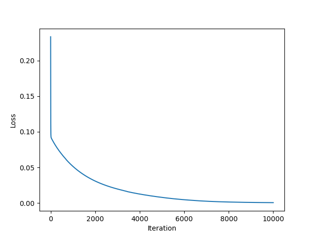
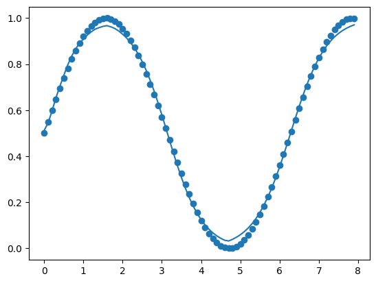

# Madrin

A cute Neural Network library with Keras-like API with just 100 lines of code. Build for fun and educational purposes. Because the code is so simple, it is very easy to change to your needs. Still under active development. 

### Dependencies
- [numpy](https://numpy.org/install/) 

### Demo

**Create a neural network:**<br>
You can create a Neural Network by passing a list of layers to the `Network` constructor.<br>
Currently it supports the following layers:
>`Linear(no_of_neurons, input_size)`<br>
>`Relu()`<br>
>`Sigmoid()`<br>
>`Tanh()`<br>
>`Softmax()`<br>

```python
from neuron import *

model = Network([ Linear(50,1), Relu(),
                  Linear(50, 50), Relu(),
                  Linear(50, 50), Relu(),
                  Linear(1,50), Sigmoid() ])
```

**Training**<br>
```python
model.fit(inputs, labels, learning_rate, epochs, loss='mse') 
```

**Evaluate**<br>
```python
model.costs(inputs, labels) #Compute the mean square error
```

**Predictions**<br>
```python
model.forward(inputs)
```

**Visualize the learning**<br>
```python
import numpy as np
import matplotlib.pyplot as plt
plt.plot(np.arange(len(model.costs)),model.costs)
plt.xlabel("Iteration")
plt.ylabel("Loss")
plt.show()
```

<br>
**Visualize the predictions(if possible)**<br>
```python
plt.scatter(inputs, labels)
plt.plot(inputs, model.forward(inputs))
plt.show()
```

<br>
